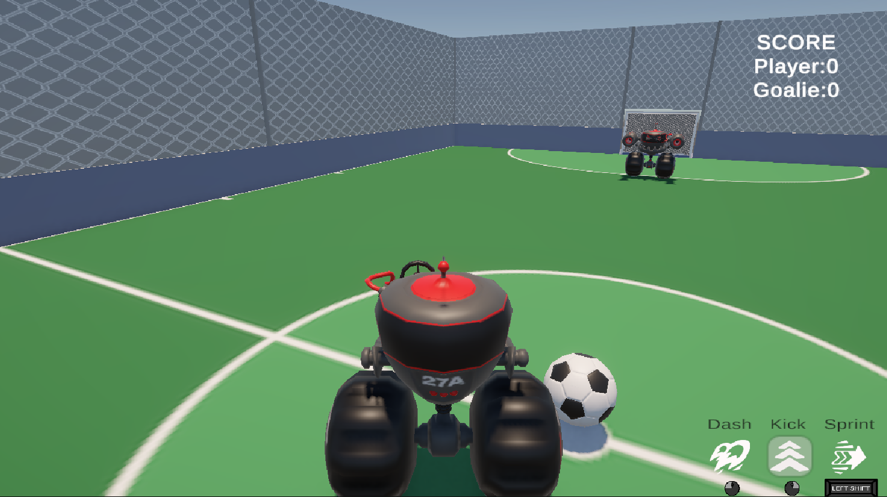
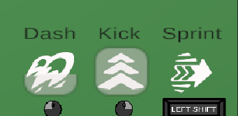

# Robot Soccer 🤖⚽

> A 3D robot soccer game built in Unity — player vs AI goalie, with physics-based ball mechanics, a futsal court, custom robot models, and a full HUD.

---

## Screenshots

### Gameplay

### HUD & Controls

---

## Description

Robot Soccer is a 3D single-player game where you control a robot on a futsal court and attempt to score goals against an AI-controlled goalie. The player robot and AI goalie follow the same physics rules — same acceleration, top speed, and turning behaviour. The ball moves according to Newtonian physics with tuned friction and bounciness for responsive gameplay.

---

## Features

### Player Robot
- Tank-style controls — the robot always moves in the direction it faces, making it intuitive to drive at both low and high speed
- Drive forwards and backwards, turn left and right — no sideways sliding
- Wheels rotate to match movement and turning direction
- **Kick** — launches the ball forward when it is close enough and in front of the robot
- **Sprint** — temporary speed boost with a cooldown meter
- **Dash** — short-range burst for repositioning or closing on the ball

### AI Goalie
- Defends the goal by tracking the ball and positioning itself between the ball and the net
- Follows the same physics rules as the player — same acceleration and top speed
- Does not get stuck when the player pushes against it

### Ball
- Newtonian physics — bounces, rolls, and decelerates naturally
- Can be moved by driving into it or by using the kick ability
- Resets to centre of field after a goal is scored

### Field
- Futsal court aesthetic with marked lines and goals at each end
- Walls keep the ball and robots contained within the playing area
- Goals detect when the ball crosses the line, trigger a score update, and reset the ball

### HUD
- Score display for both sides
- Control reference overlay
- Dash meter — shows cooldown before next dash is available
- Sprint meter — shows sprinting status
- Kick indicator — shows when a kick is ready

---

## Controls

| Input | Action |
|-------|--------|
| `W` / `S` | Drive forwards / backwards |
| `A` / `D` / `Mouse` | Turn left / right |
| `Mouse Left Click` | Kick |
| `Shift` | Sprint |
| `Mouse Left Click` | Dash |

---

## Tech

- **Engine:** Unity 6.5
- **Language:** C#

---

## Author

**Ruian (Ryan) Ding**
[github.com/Ryan-c137](https://github.com/Ryan-c137)
